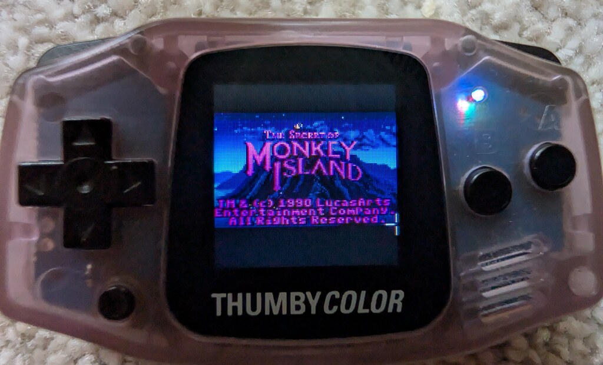
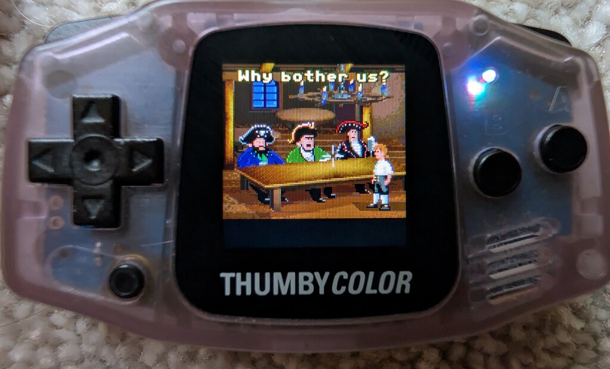
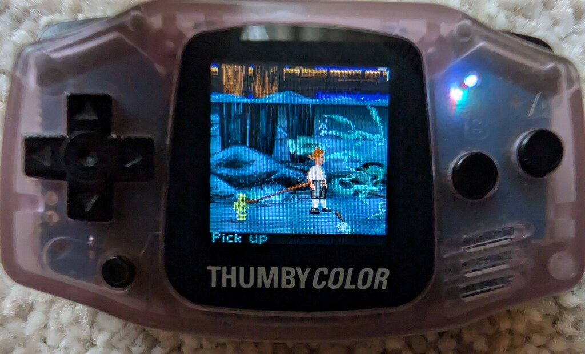
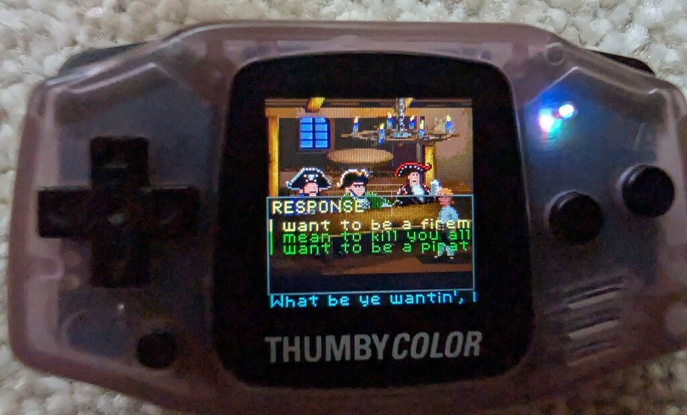
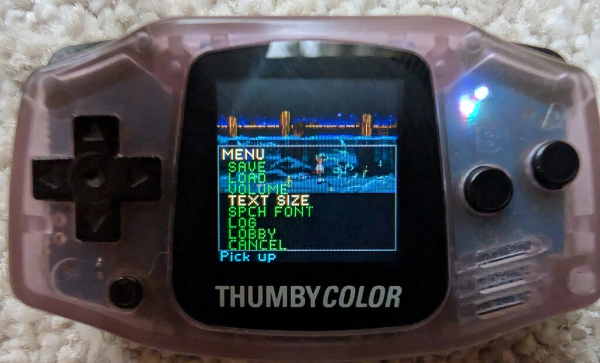
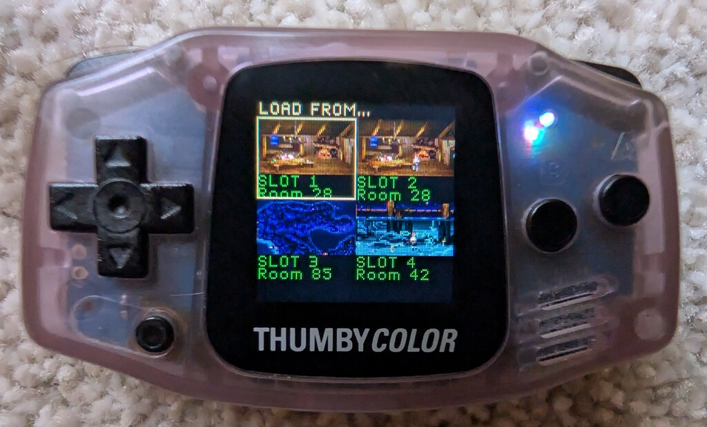
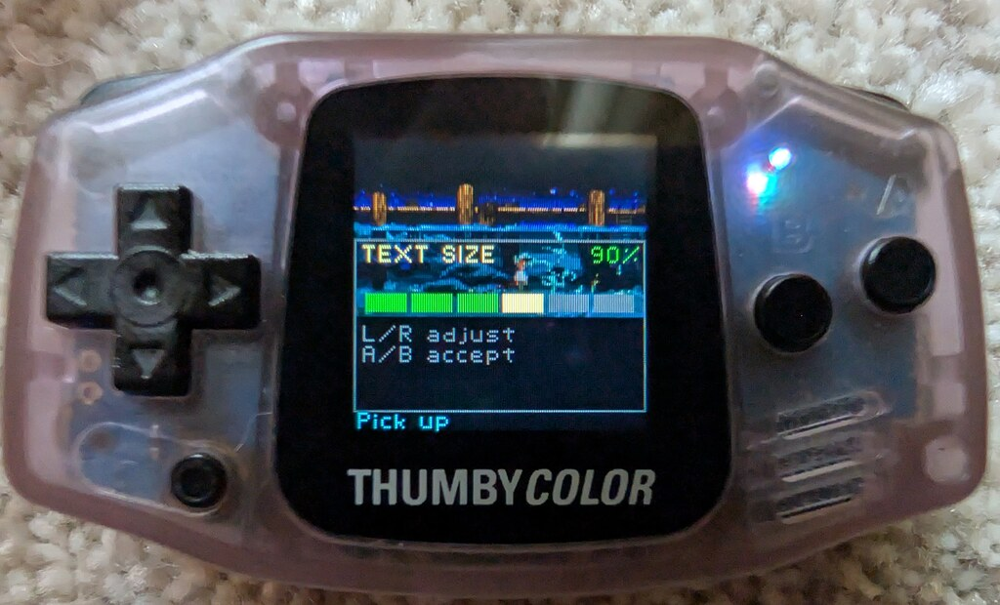

# ThumbyScummby

A port of the SCUMM v4/v5 engine to the **Thumby Color** handheld.  Two
LucasArts adventures have been brought up on the device:

- *The Secret of Monkey Island* (VGA Floppy, 1990) — SCUMM **v4**, the
  initial reference title.  4 × encrypted `DISKnn.LEC` plus `000.LFL` /
  `90n.LFL` containers, 256-colour VGA, AdLib-only music delivered as the
  v4 `AD` payload format.
- *Indiana Jones and the Fate of Atlantis* (Floppy DOS, 1992) — SCUMM
  **v5**, the harder target.  HD-installed two-file container
  (`atlantis.000` + `atlantis.001`), expanded 16-colour text overlay,
  and an iMUSE score delivered as Standard MIDI files wrapped in a SCUMM
  `MDhd` header with the OPL2 instrument table shipped inline as SCUMM-
  format SysEx.

The engine runs natively on the device's RP2350; a Linux/SDL2 build of the
same engine is used for development and regression testing.  *Monkey Island
2* (also v5 floppy) is structurally compatible with the Atlantis code path
and uses the same SMF/MDhd music format, but has not been brought up as a
shipping configuration.

This is a fan project.  The engine code is transcribed from ScummVM (heavily
slimmed — only the v4 and v5 code paths are retained, the HE/v6/v7/v8/NES/Mac
engine variants are stripped) and re-shaped to fit a 520 KB SRAM budget.  No
game data is included — you supply your own legitimately purchased install
disks; the build script extracts them and embeds the resource files into the
firmware image.

<p align="center">
  
  
  
</p>

---

## Player Guide

### What this is

ThumbyScummby plays *The Secret of Monkey Island* or *Fate of Atlantis* on a
128×128 LCD that fits on a keyring.  The originals are 320×200, 256-colour,
mouse-driven point-and-click adventures; the device has nine buttons and
roughly one-fifth of the pixels.  The port preserves the original game logic
exactly (the SCUMM virtual machine and its scripts run unchanged) but
replaces the verb panel and sentence line with overlay UI sized for the
smaller screen, and adds a contextual cursor tooltip that speaks for the
missing right hand of a mouse.

The shipping firmware image is built against a single game's resources at
compile time.  `device_pico/CMakeLists.txt`'s `DATA_DIR` selects which game
the `.uf2` boots into; rebuild and reflash to swap titles.

### Hardware

You need a **Thumby Color** handheld from
[TinyCircuits](https://tinycircuits.com).  No additional hardware is
required.

### Installing the firmware

1. Power the device off.
2. Hold the **DOWN** dpad button.
3. Power the device on while still holding DOWN.  It will mount as a USB mass-
   storage drive named `RP2350` on your computer.
4. Drag and drop `firmware_thumbyscummby.uf2` from the latest release onto
   that drive.  The drive will eject automatically when the flash completes
   and the device will reboot into the game.

The firmware contains the engine and the embedded game data.  No SD card or
external storage is involved.

### Controls

| Button | Action |
|---|---|
| **D-pad** | Move the on-screen cursor.  Cursor velocity is tuned per scale mode (Fit/Fill 2 px per frame, Crop 1 px per frame) so the time to cross the visible scene is consistent.  In Fill / Crop the scene pans under the cursor when it reaches the visible edge. |
| **A** | Left-click — apply the currently selected verb to the hovered object, pick the highlighted item, advance dialog. |
| **B** | Right-click — perform the cursor's tooltip verb (the default action) on the hovered object. |
| **LB tap** | Open the verb / dialog-response picker. |
| **RB tap** | Open the inventory picker. |
| **MENU tap** | Cycle the scale mode: Fit (whole 320×200 frame letter-boxed) → Fill (vertical-only crop, full width) → Crop (1:1 native, scene scrolls under the cursor). |
| **MENU hold ~600 ms** | Open the in-game menu (SAVE / LOAD / VOLUME / TEXT SIZE / SPCH FONT / CANCEL). |
| **LB + RB held together** | ESC — skip a cutscene, dismiss a banner. |

<p align="center">
  
  
  
</p>

The menu opens any time during play — volume, text size, and font are
always reachable, including mid-cutscene.  Inside the menu only the
two storage rows are conditional:

- **SAVE** is greyed out and the row shows a right-aligned
  "CAN'T SAVE NOW" when the player isn't currently in control of the
  character (mid-walk, inside a `cutScene` stack frame).  This matches
  the original SCUMM behaviour — the stock interpreter disabled the
  SAVE verb in the same situations, because loading a mid-action save
  resumes into a corrupted pathfinding state ("I cannot reach it"
  lock-up).  A is silently ignored on the greyed row; no fake "SAVED"
  message.
- **LOAD** is greyed out until a save exists.

VOLUME, TEXT SIZE, and SPCH FONT each open a sub-screen with d-pad
adjustment and A / B / MENU to confirm-and-return.  All three persist
across power cycles in a dedicated 4 KB flash sector below the save
region.

Host SDL build maps the buttons to keys: W/A/S/D = d-pad (arrow keys
also work), `.` = A, `,` = B, LShift = LB, Space = RB, Return = MENU,
Esc = ESC.

### Features that are not in the original DOS game

- **Persistent save slot.**  A single slot, written into a reserved 64 KB
  region at the top of the device's flash.  Reflashing the firmware does not
  erase it — the save region sits well above the firmware image and is
  preserved across UF2 updates.
- **Persistent settings.**  Master volume, speech text size, and the speech
  font choice persist in a separate config sector.
- **Speech text scale slider.**  Step the dialogue text from 75% to 100% of
  source size in 5% increments.  Default is 75%, which matches the
  scene-blit downsample; 100% is more legible at the cost of more wrapping.

  <p align="center">
    
  </p>
- **Speech font toggle.**  Switch the dialogue font between the original
  SCUMM `CHAR` resource (faithful, with characteristic 8 px serifs) and a
  small clean LucasArts-style overlay font shipped with the project.  The
  overlay font is often more readable at 128 px.
- **Cursor tooltip.**  Hover a clickable object and the cursor labels itself
  with the contextual default action: *Look at*, *Open*, *Pick up*, *Talk
  to*, etc.  In MI1 this is read directly from the game's own hover
  machinery (script 23 writes the chosen verb id into Var[182] every
  frame); it is a 100% authentic match for what right-click would do,
  with no heuristics.  In Atlantis the same Var[182] read silently
  yields no value, so the cursor is unlabelled — B-click still triggers
  the engine's default verb either way.
- **Sentence strip pinned at the bottom.**  Rows 120–127 of the LCD are
  reserved for the active verb-plus-object sentence ("Walk to bartender",
  "Use rubber chicken with broken rope") regardless of scale mode.
- **Verb and inventory pickers as overlay UI.**  The game's verb panel
  (source rows 144–199) is suppressed; the picker is rendered in the
  overlay font over the scene, which trades pixel-perfect fidelity for
  readability.

### Playing tips

- In MI1, the Mêlée Island map (room 85) was historically the most
  memory-pressured scene — a full-screen 320×200 background buffer that
  broke earlier builds.  With the rtBuffer pinning fix described below,
  it is stable, and the same fix pre-empts the equivalent room
  transitions in Atlantis.
- Use **Crop** mode for dense scenes (the SCUMM Bar interior, the
  cartographer's shop, the dig sites in Atlantis) when you want
  pixel-accurate detail.  The crop window follows the cursor.
- Use **Fit** for cutscenes and overhead shots where seeing the whole frame
  matters more than per-pixel detail.
- The save slot survives a firmware reflash — feel free to update the
  firmware mid-playthrough.  Settings (volume, text size, speech font)
  survive separately in their own flash sector.

---

## Technical Deep-Dive

The hard part of running an LucasArts adventure engine on a 128×128 RGB565
handheld is not the CPU — the RP2350's dual Cortex-M33 cores at 250 MHz are
fine for SCUMM's modest per-frame budget — but the memory.  The original
engine assumes it can `malloc` whatever resource it currently needs;
ScummVM's `expireResources` mechanism evicts cached resources to keep the
heap below a soft limit.  On a desktop with multi-GB heaps that's invisible
overhead.  On the device, with 352 KB of heap, it is the entire engineering
problem.

The rest of this document describes how the port is structured, where data
lives, and what failed before it worked.

### Architecture overview

The repository has three top-level code directories plus a tools tree:

```
ThumbyScummby/
├── engine/         # transcribed ScummVM C++ engine + shim layer
│   ├── include/
│   └── src/
├── device_pico/    # RP2350 bare-metal entry point and drivers
├── host_sdl/       # Linux/SDL2 entry point for development
└── tools/          # build-time helpers (data packer, etc.)
```

`engine/` is OS-independent.  It compiles into a static library that both
backends link against.  The directory structure mirrors ScummVM's enough
that upstream sources can be diffed against `engine/src/*` directly when
chasing parity bugs.

`engine/include/platform.h` is the abstraction the engine talks to for
"outside-world" services: LCD present, button poll, audio sink, sleep,
millis, log.  Each backend implements that contract:

- `device_pico/platform_pico.cpp` drives the GC9107 LCD over SPI/DMA, polls
  GPIO buttons, runs the PWM audio output, and uses the hardware timer for
  millis.
- `host_sdl/platform_sdl.cpp` fills the same surface with SDL2 — keyboard
  for buttons, an SDL window for the LCD, an SDL audio device for sound.

`engine/include/osystem_thumby.h` (`tsb::OSystem_Thumby`) is the project's
subclass of ScummVM's `OSystem`.  Everything inside the engine that
historically went through ScummVM's `g_system` — `copyRectToScreen`,
`getMixer`, `setMouseCursor`, `getMillis`, `logMessage` — is bridged to
`tsb::platform::*`.  This is the single seam between the upstream engine
code and the rest of the system.

### Display pipeline

The native scene is 320×200, 8 bpp paletted.  The LCD is 128×128, RGB565.
That ratio is 0.4× horizontally and 0.64× vertically and there is no
combination of them that simultaneously preserves the aspect ratio and
shows everything pixel-for-pixel.

Three scale modes resolve the tension differently:

- **Fit** — 320→128 horizontal box-blend downsample, full width.  Letter-
  boxed top and bottom because vertical compression to 0.4× would crush
  the verb panel into illegibility.  This is the default mode and shows
  the whole 320×200 frame.
- **Fill** — vertical-only crop (200 source rows mapped onto the LCD with
  the same horizontal downsample as Fit), full width visible.  Roughly 5:3
  effective aspect ratio.  Shows more of the scene per pixel than Fit at
  the cost of clipping the top and bottom.
- **Crop** — 1:1 native pixel mapping with a scrolling 128×128 viewport
  that follows the cursor.  Pixel-perfect; the entire scene is reachable
  by walking the cursor toward an edge.

The sentence strip (rows 120–127) is rendered as a separate overlay in the
overlay font and pinned at the bottom of the LCD regardless of scale mode.
Verb and inventory pickers are also overlay UI — not part of the scaled
scene blit.  The original game's verb-panel area (source rows 144–199) is
blanked when a verb panel is active so stale title-screen pixels don't bleed
through during the brief window before the engine repaints it.

The text overlay pipeline in `osystem_thumby.cpp` is the most interesting
piece.  When the engine calls `CharsetRendererClassic::printCharIntern`,
glyphs are normally written into an 8-bpp text surface, which the present
loop would then crush into 2-3 LCD-pixel-tall illegibility.  Instead, the
hook intercepts each glyph and feeds it to
`OSystem_Thumby::renderGlyphToTextOverlay`, which appends an `LcdGlyph`
record to a per-line buffer (kept for layout — centring, word-break wrap).
On line flush, the buffer is converted into a flat list of `TextStamp`
descriptors that the platform present loop draws directly into the RGB565
framebuffer at LCD-native 1×.  When the user has enabled the overlay font
toggle, the same line buffer is instead handed to `tsb::mi_font::draw` which
emits a single rendered string in the small clean font.

A list of stamps is far cheaper than a 128×128×8bpp overlay surface (16 KB
of BSS): the stamp list caps at 192 entries, ≈3 KB.  That difference matters
on a part with 520 KB of total SRAM.

### Memory engineering

The RP2350 has 520 KB of SRAM.  The static and BSS regions claim ~140 KB,
the stack reserves ~4 KB, leaving room for a heap.  `device_pico/CMakeLists.txt`
sets:

```
PICO_HEAP_SIZE=0x58000   # 352 KB
```

352 KB is the largest heap that fits without the linker complaining "cannot
move location counter backwards" against the static layout.  That is the
budget the engine has to live inside.

#### Game data is XIP-resident

The 16 MB flash chip is mapped into the address space at `0x10000000`.  Code
and data alike can be read directly from flash through the eXecute-In-Place
controller — there is no requirement to copy anything into RAM to use it.

`tools/pack_device.py` reads the user-provided MI1 install
(`data/mi1_vga/000.LFL`, `DISK01.LEC` … `DISK04.LEC`, `901.LFL` …
`904.LFL`), pre-XORs the encrypted LEC files with the v4 0x69 key so the
runtime engine doesn't have to (it would otherwise double-XOR), and emits a
single binary blob.  `device_pico/data_section.S` `.incbin`s that blob into
the firmware image.

The crucial trick is in the resource loaders.  Where ScummVM's
`ResourceManager::loadResource` would `read()` the resource into a freshly
`malloc`'d buffer, the port instead asks the file backend for a raw flash
pointer:

```cpp
// engine/src/resource.cpp:730
const void *rawPtr = _fileHandle->getRawPointer(size);
if (rawPtr) {
    _res->_types[type][idx]._address = const_cast<byte *>((const byte *)rawPtr);
    _res->setOffHeap(type, idx);
    /* ... */
}
```

`setOffHeap` flips the `RF_OFFHEAP` status bit; `nukeResource` then knows
not to `free()` it, and `expireResources` knows it doesn't count against
heap pressure.  The engine reads this resource directly out of flash.  No
copy, no heap usage, no eviction.

The same pattern is applied to sound resources late in the project, in
`audio_shim.cpp:readSoundResourceSmallHeader`.  Some AdLib music tracks are
60+ KB and were a significant fraction of the heap before this fix; now
they cost zero RAM.

This pattern handles rooms, scripts, costumes, sounds, charsets, and the
object data tables — anything the engine reads but doesn't write to.

#### The rtBuffer slot pinning fix (Room 85 OOM)

The Mêlée Island map (room 85) crashed with an OOM on its second visit
during a long playthrough.  This subsystem's investigation and fix is the
defining piece of memory engineering in the project.

A custom `malloc` shim was wired in temporarily to capture both the failing
allocation size *and* the caller's program counter via
`__builtin_return_address(0)`.  When the panic fired the shim recorded:

```
calloc(65282) failed; LR = 0x10001a4f
```

`addr2line` resolved that LR to `resource.cpp:935`, inside `createResource`.
The size — 65 282 — is `320 * 200 + 320 * 4 + SAFETY_AREA(2)`: the main
virtual screen's back buffer for a full-screen scrollable room.  The
allocation itself was reasonable.  The problem was that the back buffer is
nuked and re-allocated *per room transition* with a varying size (most rooms
are `320 * 144` for the gameplay area; only a handful are full-height
`320 * 200`).  After enough transitions the heap was fragmented to the point
where ~64 KB contiguous was no longer findable even though more than 100 KB
total was free.

The fix has two parts:

1. **Pre-allocate the rtBuffer slots eagerly** at engine init while the heap
   is still pristine.  In `scumm.cpp:1742`, immediately after the text
   surface is created, three rtBuffer slots are reserved at maximum size:

   ```cpp
   const uint32 max_main_buf = (uint32)(_screenWidth * _screenHeight + _screenWidth * 4);
   _res->createResource(rtBuffer, kMainVirtScreen + 1, max_main_buf);  // primary
   _res->createResource(rtBuffer, kMainVirtScreen + 5, max_main_buf);  // back buffer
   _res->createResource(rtBuffer, 9,                  max_zbuf);       // Z buffer
   ```

   These three blocks now sit at the heap floor for the lifetime of the
   process; nothing else can fragment around them.

2. **Short-circuit `createResource` for `rtBuffer` reuse.**  In
   `resource.cpp:912`, when the engine asks to recreate an `rtBuffer` slot
   that already has an address whose existing size is at least the requested
   size, the existing block is zeroed in place and returned without nuke or
   `malloc`:

   ```cpp
   if (type == rtBuffer && _types[type][idx]._address &&
       _types[type][idx]._size >= size) {
       std::memset(_types[type][idx]._address, 0, size);
       setResourceCounter(type, idx, 1);
       return _types[type][idx]._address;
   }
   ```

   The caller (`initVirtScreens`) `memset`s its buffer immediately after
   `createResource` returns anyway, so the contract is preserved.

Together these two changes turn the per-room back-buffer churn into a no-op.
Room 85 is now stable on repeat visits.

#### Aggressive expireResources on room change

The pre-existing ScummVM pattern is that `expireResources` evicts unlocked
resources when total allocated size exceeds `_minHeapThreshold`.  The
threshold is bumped on room change in `room.cpp:155`:

```cpp
_res->publicExpireResources(96 * 1024);
```

so that each new room starts loading from a clean baseline.  Combined with
the XIP-direct loaders (which cost zero heap to "load"), heap usage in
steady state is dominated by the three pinned rtBuffer slots and the
in-flight scratch from costume rendering and the OPL2 emulator.

#### Packing the text-overlay surface to 4 bpp (v5 fit)

MI1 (v4) keeps its 8 bpp `_textSurface` — a CLUT8 320×200 = 64 KB BSS
allocation — and there is just enough heap headroom for it.  Atlantis
(v5) pushes the heap pressure ~50 KB higher (larger costumes, more
sound payload in flight, second-pass back-buffer chatter during pass
transitions) and on the first attempt the engine dies on the pass-2
main back-buffer allocation at ~440 KB attempt against the 388 KB
ceiling: a ~52 KB shortfall.

`engine/include/scumm/packed_text_surface.h` is the device-side
replacement for `Graphics::Surface` on the `_textSurface` slot.  Two
4-bit palette indices per byte, so the same 320×200 surface drops to
32 KB — half the storage, same coverage:

- nibble `0x0..0x0E` → palette indices 0..14
- nibble `0x0F`      → transparent (the engine's `CHARSET_MASK_TRANSPARENCY`
  sentinel `0xFD` at the 8 bpp boundary)

ScummVM's text renderer normally writes pixels through raw pointer
arithmetic via `Graphics::Surface::getBasePtr() + pitch`, which can't be
silently retargeted at a packed surface (a single byte write would
corrupt two adjacent pixels).  `PackedTextSurface` instead exposes an
explicit-call API — `setPixel`, `fillSpan`, `fillRect`, `clearTransparent`,
`readRow`, `spanIsAllTransparent` — and the few SCUMM call sites that
poke `_textSurface` directly are converted at the source level.

The compositor (`drawStripToScreen` in `gfx.cpp`) unpacks one row at a
time into a 640-byte stack scratch buffer via `readRow`, then runs the
existing inner loop unchanged.  Out-of-range palette writes (15..252)
clamp to `0x0E` and latch a once-per-session flag so we'd find out
empirically if any v5 text actually used those indices — none does.

The `_textSurface` member type is conditional: `PackedTextSurface` on
`THUMBY_DEVICE`, stock `Graphics::Surface` on the host build (no memory
pressure desktop-side; keeps the Mac / CJK / HE library `Font::drawChar`
paths working unchanged).  On device those paths are `#ifndef
THUMBY_DEVICE`-gated — the games we ship there don't use them.

Net device saving: **32 KB sustained**.

#### Verb VirtScreen with height = 0 (v5 fit)

Source rows 144..199 are the SCUMM verb panel.  On Thumby Color the
verb panel is suppressed entirely — the scene-only redesign renders verbs
and inventory as overlay UI in the small clean font (see [Display
pipeline](#display-pipeline) and the *scene-only redesign* commit
history).  The engine still allocates a backing `kVerbVirtScreen`
buffer at `initVirtScreens` time even though `present()` never reads it.

The fix is a one-liner in `gfx.cpp` `initScreens` under `THUMBY_DEVICE`:
pass `height = 0` for the verb VS.  The engine still calls
`initVirtScreen` for that slot, but with degenerate dimensions the
backing allocation collapses to a 2-byte sentinel.  Saves **~18 KB
sustained** (320 × 56 × 1 bpp).

#### rtBuffer pre-reserve, moved earlier for v5

The pre-reserve and reuse-short-circuit machinery from the [rtBuffer
slot pinning fix](#the-rtbuffer-slot-pinning-fix-room-85-oom) had to be
moved a few steps earlier in the boot sequence for Atlantis to fit.
Two adjustments:

1. The three `rtBuffer` slots (kMainVirtScreen primary, back buffer, Z
   buffer) are now reserved at the heap floor *between* `readIndexFile`
   and `resetScumm`, before any v5 resource loading begins.  On MI1 the
   timing was less sensitive (the v4 boot doesn't load much resource
   state ahead of the back-buffer alloc); on Atlantis there is enough
   v5 housekeeping in the gap that the back buffer would otherwise land
   well above the heap floor.

2. The `initScreens` nuke-loop is disabled under `THUMBY_DEVICE`.  Its
   job is to free any pre-existing rtBuffer slots before re-creating
   them at the right size; with the slots pre-reserved at maximum size
   the `createResource` reuse short-circuit in `resource.cpp:912` only
   actually fires when the nuke step doesn't run first.

Combined with the 4 bpp text surface and verb-VS-0, this brings the
peak heap demand back inside the 352 KB budget.  The remaining margin
on Atlantis is comfortable but not large.

#### v5 boot infrastructure: HD-installed containers

MI1's v4 layout — one master index `000.LFL`, four encrypted disk
`DISKnn.LEC`, four uncompressed helper `90n.LFL` files — is the format
the original v4 resource loader expects.  Atlantis ships an "HD
installed" layout instead: `atlantis.000` (index, encrypted) and
`atlantis.001` (combined data, encrypted), and the engine generates
file names via `_filenamePattern` + a generation method (`kGenDiskNum`,
`kGenHEPC`, etc.).

What was needed for v5:

- `tools/pack_device.py` detects the layout: `000.LFL` present →
  v4-floppy, else look for `*.000` → v5-hd, fill in the master and
  disk1 TOC slots with `.000` and `.001`, leave the remaining slots
  empty.  This keeps the on-device data-blob shape unchanged.
- `scummvm_link_stubs.cpp` resolves file requests by suffix
  (`.000` → master, `.001` → disk 1) so v5's generated names hit the
  XIP fast path the same way the v4 `DISKnn.LEC` names did.
- `device_pico/main.cpp` builds a `DetectorResult` with
  `GID_INDY4`, version 5, platform DOS, `GF_USE_KEY`,
  `variant = "Floppy"` (required — `input.cpp:1098` strcmps that
  string for Indy 4), `_filenamePattern = "atlantis.%03d"`, and
  `genMethod = kGenDiskNum`.  The engine is then a
  `ScummEngine_v5`.
- `script_v5.cpp` null-guards `_saveFileMan` on the Indy 4 IQ-points
  save path.  `_saveFileMan` is intentionally null on the device (the
  port has its own single-slot save backend); v4 never went through
  the `_saveFileMan` IQ path.

The same `pack_device.py` invocation builds either game's data blob;
the `DATA_DIR` CMake variable in `device_pico/CMakeLists.txt` is the
only switch.

### Build pipeline

`device_pico/CMakeLists.txt` builds the engine as `thumbyscummby_engine`,
links the device-side `main.cpp` against pico-sdk libraries (`pico_stdlib`,
`hardware_spi`, `hardware_dma`, `hardware_pwm`, `hardware_irq`,
`hardware_timer`, `hardware_flash`), runs `tools/pack_device.py` to produce
the data blob, and assembles `firmware_thumbyscummby.uf2`.

The `DATA_DIR` CMake variable points the packer at one game's install
directory.  `pack_device.py` auto-detects the layout:

- `000.LFL` present → v4 floppy (MI1).  Pack `000.LFL` + the four
  `DISKnn.LEC` files + the four `90n.LFL` helpers.
- otherwise → v5 HD-installed.  Pack `<base>.000` as the master and
  `<base>.001` as the disk-1 slot; leave the remaining seven TOC
  entries empty.

The on-device data blob keeps a fixed 9-entry TOC regardless of game;
the empty slots add no flash bloat.  `scummvm_link_stubs.cpp` resolves
file requests by file-suffix so v5's runtime-generated names hit the
right slot.  Switching titles is a CMake rebuild and a UF2 reflash.

`host_sdl/CMakeLists.txt` links the same engine library against SDL2 for
the Linux dev loop.  The host build reads the game files from a passed-
in directory at runtime (no XIP shenanigans needed when you have
gigabytes of RAM); `platform_sdl.cpp`'s `load_data_dir` auto-detects
v4-floppy vs v5-HD the same way the packer does.  Otherwise it
exercises the same engine code paths as the device.

One engine, two backends: hot-iterate on the host, ship on the device.

```bash
# Host build (Linux/SDL):
cmake -S . -B build
cmake --build build -j
DISPLAY=:0 ./build/host_sdl/thumbyscummby data/mi1_vga

# Device build (RP2350):
bash device_pico/build_device.sh
# produces firmware_thumbyscummby.uf2
```

Host keyboard mapping: W/A/S/D (or arrow keys) = d-pad, `.` = A, `,` = B,
LShift = LB, Space = RB, Return = MENU, Esc = ESC.

### SCUMM-specific lessons

**Var[182] for the cursor tooltip (MI1).**  MI1 VGA's stock interpreter
highlights verbs under the cursor by running global script 23 every frame;
that script calls `startObject(hovered_obj, 90, [])` to invoke the
OBJECT'S OWN verb-entry 90 ("default action"), which writes the
appropriate verb id into Var[181].  Script 23 then highlights that verb
in colour 14 and remembers its id in Var[182] so the next frame can
un-highlight on hover-change.  The port reads Var[182] directly via
`publicReadVar(182)` and renders the matching verb name as the cursor
tooltip.  This is a pure read with no script execution and no side
effects, and the result is a 100% match for the game's own hover-
highlight intent.  Pirate → *Talk to*, door → *Open*, inventory item →
*Pick up*, all decided by the game's scripts, not by heuristics in the
port.  Atlantis's scripts use a different highlight mechanism; the same
`publicReadVar(182)` call yields no value there, the tooltip stays
empty, and the cursor renders without a label.  Reading Var[182] in
that case is harmless — a `getVerbEntrypoint`-based fallback exists in
the same function and could be re-enabled if a v5 tooltip is wanted.

**Inventory tooltip via OBCD verb-entry 90.**  Inventory items aren't
verbs, but each item knows its own preview verb encoded in its OBCD
(`publicGetVerbEntrypoint(obj, verb_id)`).  The inventory picker looks up
the verb name in `_verbs[]` and uses the same tooltip rendering path as
in-scene objects.

**Dialog response detection by engine state, not text.**  An early version
tried to detect "the engine is showing a dialog response menu" by
pattern-matching the text being drawn.  This was a mistake — text patterns
varied across dialog scripts and locales, and false positives broke the
verb picker's auto-open logic.  The current implementation (`verb_picker.cpp`)
keys off engine state: `_userPut` flag combined with the visibility of any
non-standard `kTextVerbType` slot.  This is the same state the engine
itself uses to decide whether to accept input.

**`publicConvertMessageToString` for inventory names.**  Raw OBCD bytes
contain `0xFF` control codes for inline sound markers, colour codes, name
substitutions, and so on.  Calling
`ScummEngine::convertMessageToString` (exposed as
`publicConvertMessageToString`) before measuring or rendering an inventory
item's name ensures parity with the engine's own text rendering — for
instance an item called "pieces of eight" goes through the same expansion
the engine would use when drawing it natively.

### Notable engineering choices

**No custom malloc in the shipping firmware.**  A custom `malloc` shim was
written for the OOM-diagnostic phase of the rtBuffer fragmentation
investigation.  It logged size + caller PC for every allocation and was
invaluable in finding the cause.  Once the bug was understood and the
pin-and-reuse fix was in place, the shim was retired in favour of the SDK's
default allocator.

**iMUSE + DOSBox OPL2.**  `engine/src/dbopl.cpp` is the upstream DOSBox
OPL2 emulator, dropped in verbatim after an earlier hand-rolled attempt
was retired (commit `078fc35`).  Full-featured: 9 voices, full instrument
table.  A precision-conscious experiment moved its precomputed sin/exp
tables into flash (instead of BSS) to reclaim ~9.4 KB of heap; the
result was audibly worse, with subtle but real artifacts on certain
instruments — likely a precision difference between host-generated
tables and a different code path emitting them at runtime on device.
The change was reverted; the tables stay in BSS and the heap savings
were found elsewhere.

**Single-core operation.**  Core 1 is unused.  An earlier attempt to run
the audio mixer on core 1 hung the engine init in the
`multicore_launch_core1` FIFO handshake.  Audio mixing is currently driven
from the timer IRQ on core 0; the budget is comfortable.

**Logging is on-screen, not over USB.**  USB CDC enumeration was unreliable
at 250 MHz with this clock and PLL configuration, and UART can't be used
either: the default UART TX pin (GP0) is repurposed as the LEFT button
input.  Instead, the platform `log()` implementation maintains a small ring
of recent log lines and renders them as an overlay at the bottom of the
LCD.  It's surprisingly effective for an embedded debug surface.

**Cursor velocity tuned per scale mode.**  Visible source widths are 320
(Fit), ~200 (Fill), 128 (Crop).  At a single 2 px/frame velocity Crop felt
twitchy because the cursor crossed the visible area in half the time of
Fit.  Crop velocity was halved to 1 px/frame, bringing the time-to-cross to
roughly 4.3 s in all three modes.

### Audio path

iMUSE drives the AdLib path: `imuse.cpp` parses the SCUMM sound formats
(v4 `RO` / `SO` / `AD`, v5 `SOUN`/`ADL` SMF, embedded MThd MIDI),
`adlib.cpp` is the General-MIDI → OPL2 instrument bridge, `dbopl.cpp`
is the upstream DOSBox OPL2 emulator (9 voices, full instrument
table), and `audio_mix.cpp` is the 22050 Hz mono mixer that the
platform layer pulls samples from.  The platform sink writes those
samples to the RP2350's PWM audio output via DMA.

iMUSE *digital* audio (`.WAV` music, used by some later SCUMM titles) is
not supported.  Neither MI1 floppy nor Atlantis floppy has digital
music, so it isn't a player-facing limitation for these titles.

#### v5 AdLib music: SMF wrapped in MDhd + SCUMM SysEx instruments

Atlantis (and MI2 floppy) ship their AdLib score as a Standard MIDI
File wrapped inside the SCUMM `SOUN`/`ADL` chunk, with a small `MDhd`
SCUMM header sitting between the chunk type and the SMF's `MThd` —
*and* with the OPL2 instrument programs delivered as SCUMM-format
SysEx messages (manufacturer byte `0x7D`) embedded in the SMF stream.
That means v5 AdLib needs three things the v4 code path didn't:

1. **Sound resource loading for the SO/ADL path.**  v5
   `readSoundResource` was previously a stub on the port — only the v4
   `AD` formats were wired through.  `scummvm_link_stubs.cpp` now
   walks the SO chunk to pick up the embedded ADL sub-block and
   aliases its byte range through the same XIP raw-pointer fast path
   `loadResource` uses, so v5 sound stays off-heap on device exactly
   like rooms, scripts, costumes, and v4 sounds (see [Game data is
   XIP-resident](#game-data-is-xip-resident)).  Some Atlantis tracks
   are well over 30 KB; on heap they would dominate.

2. **`MDhd`-aware SMF detection in iMUSE.**  The pre-existing MThd-
   inner-scan in `imuse.cpp` would happily fire `PT_SMF` on raw v4 AD
   payloads that happened to contain those magic bytes inside their
   header — false-positives that broke the v4 parser.  Detection is
   now gated on `MDhd` magic: present → v5 SMF inside, run the inner
   scan; absent → treat the payload as the raw v4 format the AD
   parser was written for.

3. **SCUMM SysEx for instrument programming.**  Even with the SMF
   parsed correctly and notes reaching `adlib.cpp`, Atlantis was
   silent — the OPL2 channels never received their instrument
   programs.  `scumm_handle_sysex` (mirrored from upstream
   `Player::decode_sysex_bytes`) now decodes three SCUMM SysEx codes
   off the manufacturer-`0x7D` payload:

   - **SysEx 0** — *allocate part to a channel*.  Maps an iMUSE part
     number onto an OPL2 voice slot.
   - **SysEx 16** — *per-part AdLib instrument*.  Programs the voice
     directly for the named part.
   - **SysEx 17** — *global instrument bank slot*.  Stores the
     instrument bytes in a new 128-entry global bank that
     `adlib.cpp`'s Program Change handler now looks up for the v5
     code path.  The bank is populated up-front by the SMF prologue
     and indexed at runtime by GM program number.

   The nibble-decoder is a verbatim port of the upstream routine.

4. **v5 program-voice / volume curve.**  `adlib.cpp` learns a v5
   variant of the channel-instrument setter and the program-voice
   path:

   - **TL byte** = `(level | 0x3F) - vol`, where `vol` is
     velocity- and part-volume-scaled via the `g_volume_lookup` and
     `g_volume_table` tables ported verbatim from
     `scummvm-upstream/audio/adlib.cpp:862-921` —
     matches upstream `adlibSetupChannel:2113`.
   - **AttackDecay** and **SustainRelease** bytes are bitwise-NOT'd
     before reaching OPL regs `0x60` / `0x80` — matches upstream
     `adlibSetupChannel:2114-2115`.

   The v4 AD-resource path used for MI1 floppy is untouched (its
   instrument bytes are already in OPL-ready form).  The CC 7
   mid-note volume handler picks the v4 or v5 attenuation strategy
   based on the same flag.

5. **ConfMan volume defaults.**  The `ConfMan` stub previously
   defaulted `music_volume` / `sfx_volume` / `speech_volume` to zero.
   In v4 the engine never asked, so it never mattered; in v5 the
   engine reads those keys at start-up and calls
   `setMusicVolume(0)`, silencing AdLib before the score even gets a
   note.  The stub now defaults all three to
   `Audio::Mixer::kMaxMixerVolume`.

End-to-end: SO/ADL is XIP-resident, `MDhd` triggers the SMF parser,
SysEx programs the OPL2 chip, and v5's TL/AD/SR encoding hits the
registers in the form `dbopl` expects.

### Known limitations

- **One game per firmware image.**  `DATA_DIR` picks the title at build
  time and the resource blob is `.incbin`'d into the UF2.  Switching from
  MI1 to Atlantis (or vice versa) is a rebuild and a reflash.
- **Single save slot.**  The hold-LB menu has one slot.  The 64 KB save
  region could comfortably hold eight 8 KB slots; the limit is currently
  the menu UX rather than storage.
- **No iMUSE digital audio.**  AdLib only.  See the audio path section.
- **Dialog response wrap is optimistic.**  Very long dialog options
  (significantly longer than anything in the original MI1 / Atlantis
  scripts) may overflow the picker.  Not a problem in practice for the
  stock games, potentially relevant for fan translations and mods.
- **Speech text scale is global.**  The slider applies uniformly across
  actor talk, banner, and modal text.  There's no per-actor or per-speech-
  type override.
- **Atlantis heap headroom is tight.**  After the 4 bpp text surface +
  verb-VS-0 + rtBuffer pre-reserve, Atlantis fits with a comfortable but
  not generous margin.  An unfortunate combination of large costume +
  large in-flight sound + a full-screen map room could still push the
  ceiling; the worst case observed during testing leaves ~20 KB free.
- **Mac, FM-Towns, EGA branches stay compiled.**  The original ScummVM
  source has these intermixed with the v4/v5 paths and pulling them out
  cleanly is too invasive.  `--gc-sections` strips them at link time, so
  the runtime cost is zero, but they slow the build slightly.

### Provenance

This project is a derivative work of ScummVM (GPL).  The on-disk SCUMM
v4/v5 file formats, opcode set, costume codec, iMUSE sequencer model, and
DOSBox OPL2 emulator were originally engineered by LucasArts and the
DOSBox/ScummVM communities.  The port is licensed GPL-3.0-or-later (see
`LICENSE` and `NOTICE`) and *does not ship game data* — the user supplies
their own legitimately-purchased install disks for *Monkey Island* and/or
*Fate of Atlantis*.

### Acknowledgments

- LucasArts (1990–1998) — SCUMM, Monkey Island, Fate of Atlantis, the
  entire genre.
- The ScummVM project — reference implementation, two decades of
  algorithm spelunking, and the only reason a port like this is possible.
- The DOSBox project — OPL2 emulator.
- TinyCircuits — Thumby Color hardware.
